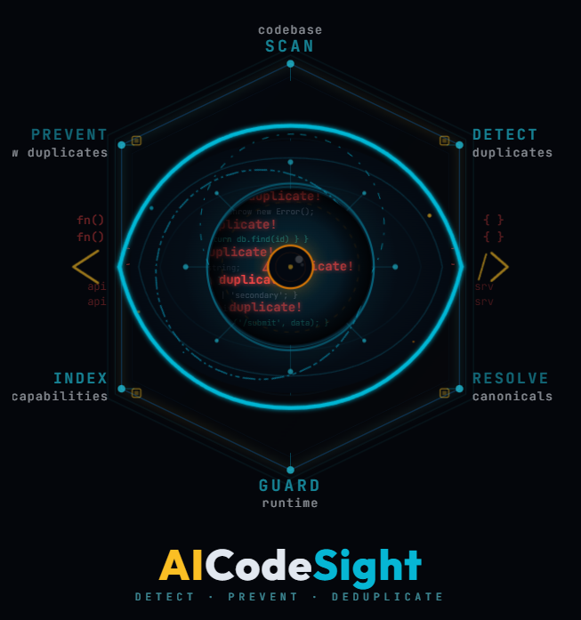

<p align="center">
  
</p>

<h3 align="center">AI code duplication stops here.</h3>
<p align="center"><strong>Built for <a href="https://docs.anthropic.com/en/docs/claude-code">Claude Code</a></strong></p>

<p align="center">
  <a href="https://www.npmjs.com/package/aicodesight"></a>
  <a href="https://github.com/mldixdev/aicodesight/blob/main/LICENSE"></a>
  
</p>

---

## The Problem

AI coding assistants are powerful — but they're **blind to your codebase**. They can't see your existing utilities, your naming conventions, or the function you wrote last week that does exactly what they're about to create from scratch.

The result? **Duplicate code. Everywhere.**

- A new `formatDate()` when one already exists in `src/utils/`
- A second `UserService` because the AI didn't know about the first
- Inconsistent naming, broken conventions, growing entropy

This isn't an AI problem. It's a **visibility** problem.

## The Solution

**AICodeSight** generates an architectural metadata layer that makes your codebase visible to AI assistants. It scans your project, catalogs every export, maps dependencies, and produces machine-readable artifacts that AI assistants consult before writing a single line of code.

```
Your Code → aicodesight init → AI can see everything → No more duplicates
```

It also installs **runtime guards** — hooks that intercept AI actions in real-time and block duplication before it happens.

## Features

- **Inventory & Registry** — Catalogs every file, export, and type signature in your project
- **Capability Index** — Enriched descriptions of what each function does and why it exists
- **Duplicate Detection** — Finds existing duplicates and resolves canonical locations
- **Dependency Mapping** — Tracks who imports what, identifies critical files
- **Guard Pipeline** — Runtime hooks that detect and prevent duplication as AI writes code
- **Convention Enforcement** — Validates naming patterns, file sizes, and structural rules
- **Session Memory** — Persists context across AI session compactions
- **Pattern Modules** — Stack-specific best practices (shadcn/Tailwind, .NET Minimal API, TanStack Query)
- **CLAUDE.md Generation** — Produces structured directives tailored to your project

## Quick Start

```bash
npx aicodesight init
```

That's it. AICodeSight will detect your project type, analyze the codebase, and generate everything.

## CLI Commands

### `aicodesight init`

Diagnose the project and generate the full architectural layer.

```bash
aicodesight init [directory]
```

| Option | Description | Default |
|--------|-------------|---------|
| `--type <type>` | Project type: `auto`, `new`, `legacy` | `auto` |
| `--hooks <mode>` | Guard mode: `yes` (block), `warn` (advise), `no` | `warn` |
| `--dry-run` | Preview without writing files | `false` |
| `--no-blueprint` | Skip architectural blueprint | — |
| `--no-interactive` | Skip prompts, use auto-detection | — |
| `--embeddings` | Enable semantic duplication guard | `false` |

### `aicodesight audit`

Deep analysis of duplication, size, conventions, and progress.

```bash
aicodesight audit [directory]
```

| Option | Description | Default |
|--------|-------------|---------|
| `--focus <focus>` | What to analyze: `duplication`, `size`, `naming`, `all` | `all` |
| `--format <format>` | Output: `console`, `md`, `json` | `console` |
| `--output <file>` | Save result to file | — |

### `aicodesight update`

Regenerate artifacts from the current code state.

```bash
aicodesight update [directory]
```

| Option | Description | Default |
|--------|-------------|---------|
| `--only <target>` | What to update: `claude-md`, `inventory`, `duplicates`, `hooks`, `registry`, `memory`, `all` | `all` |
| `--dry-run` | Preview without writing files | `false` |
| `--embeddings` | Enable semantic duplication guard | `false` |

## What Gets Generated

After running `aicodesight init`, you'll find a `.claude/` directory with:

```
.claude/
├── inventory.json          # Every file, its exports, line counts
├── inventory.md            # Human-readable inventory
├── registry.json           # Module-organized export catalog with type signatures
├── capability-index.json   # Enriched function descriptions with intent metadata
├── capability-index.md     # Human-readable capability index
├── duplicates.json         # Known duplicates with canonical resolution
├── duplicates.md           # Human-readable duplicate report
├── dependency-map.json     # Import/export dependency graph
├── dependency-map.md       # Human-readable dependency map
├── hooks/                  # Guard pipeline
│   ├── runner.js           # Guard orchestrator
│   ├── guard-config.json   # Guard configuration
│   ├── duplication.js      # Blocks duplicate exports
│   ├── convention.js       # Enforces naming conventions
│   ├── structural.js       # Detects structural duplication
│   ├── dependency.js       # Detects circular imports
│   ├── coherence.js        # Validates file coherence
│   ├── intent-*.js         # Intent declaration & similarity guards
│   ├── size.js             # File size alerts
│   └── ...
├── settings.json           # Hook configuration
└── working-memory.json     # Session persistence

CLAUDE.md                   # AI directives (project root)
```

## How It Works

```
┌─────────────────────────────────────────────────────┐
│                   aicodesight init                   │
├─────────────────────────────────────────────────────┤
│                                                     │
│  1. DETECT        Scan project structure            │
│     ↓             Identify language, framework      │
│                                                     │
│  2. ANALYZE       Build inventory of all exports    │
│     ↓             Map dependencies between files    │
│                   Detect existing duplicates        │
│                                                     │
│  3. GENERATE      Create registry & capability      │
│     ↓             index with enriched descriptions  │
│                                                     │
│  4. GUARD         Install runtime hooks that        │
│     ↓             intercept AI actions in real-time │
│                                                     │
│  5. TEMPLATE      Generate CLAUDE.md with project-  │
│                   specific directives & conventions  │
│                                                     │
├─────────────────────────────────────────────────────┤
│  Result: AI assistant now sees your full codebase   │
│  and is blocked from creating duplicates.           │
└─────────────────────────────────────────────────────┘
```

## Requirements

- **Node.js** >= 18
- Works with **TypeScript**, **JavaScript**, and **C#** projects
- **Built for [Claude Code](https://docs.anthropic.com/en/docs/claude-code)** — generates CLAUDE.md, hooks, and guards designed for the Claude Code ecosystem

## Contributing

Contributions are welcome! This project is in early development — if you find a bug or have an idea, please [open an issue](https://github.com/mldixdev/aicodesight/issues).

## License

[Apache License 2.0](LICENSE) — Use it freely. Keep the attribution. Indicate changes. Don't use the name to sell your fork.

Copyright 2025-2026 AICodeSight Contributors.

---

<p align="center">
  Built by <a href="https://github.com/mldixdev">mldix</a><br/>
  <sub>detect &middot; prevent &middot; deduplicate</sub>
</p>
